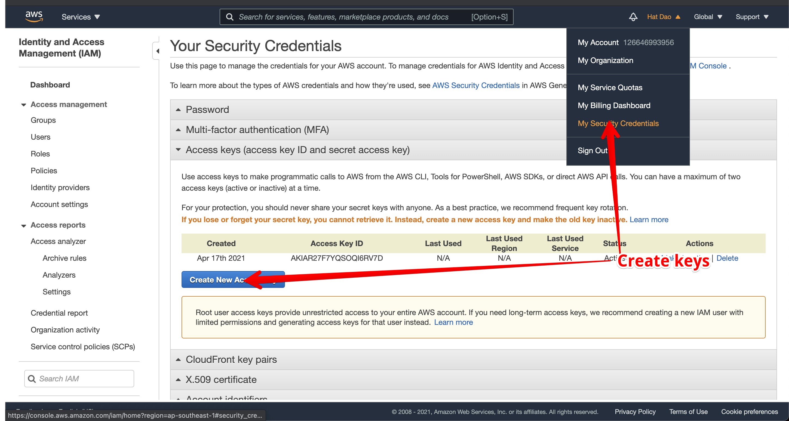

# EOH workshop


### Requirements

- An AWS account
- Get AWS access keys

- Install terraform https://www.terraform.io/downloads.html
- Install kubectl

### Steps

##### Step 1 - Setup EKS cluster

- Checkout step-1 if you couldn't follow
- Create providers.tf
- Create variables.tf
- Create main.tf
- `terraform apply`
- Run update-kubeconfig to set config for kubectl
```
aws eks update-kubeconfig --name tf-workshop --region ap-southeast-1
# copy context to provider kubernetes
```

###### Step 2 - Create deployment with external load balancer

- Checkout step-2
- Create deploy.yaml
- `kubectl apply -f deploy.yaml`
- Verify by `kubectl describe deploy`
- `kubectl expose deploy/hello-world --type=LoadBalancer --name=my-service`
- Verify by `kubectl describe svc`